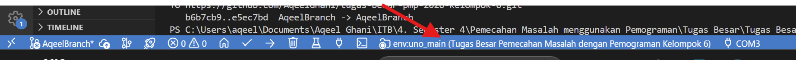
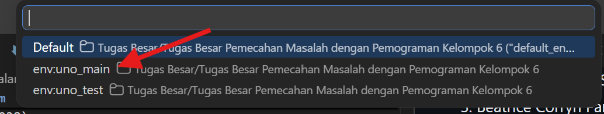
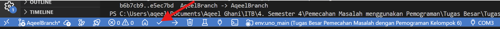
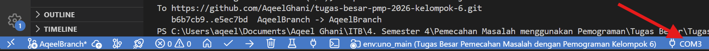
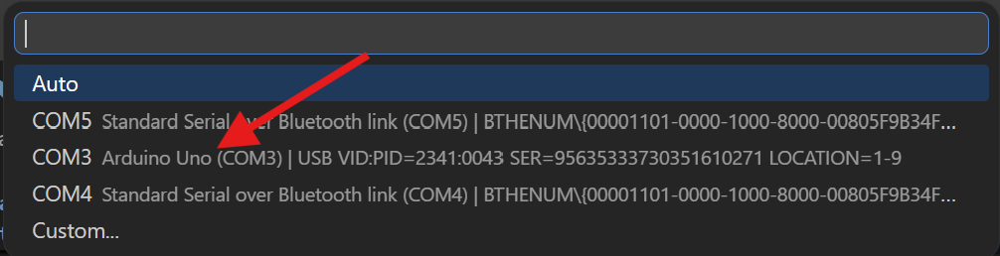
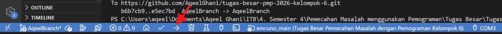
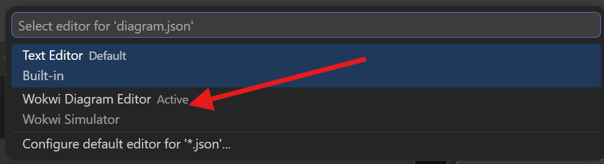
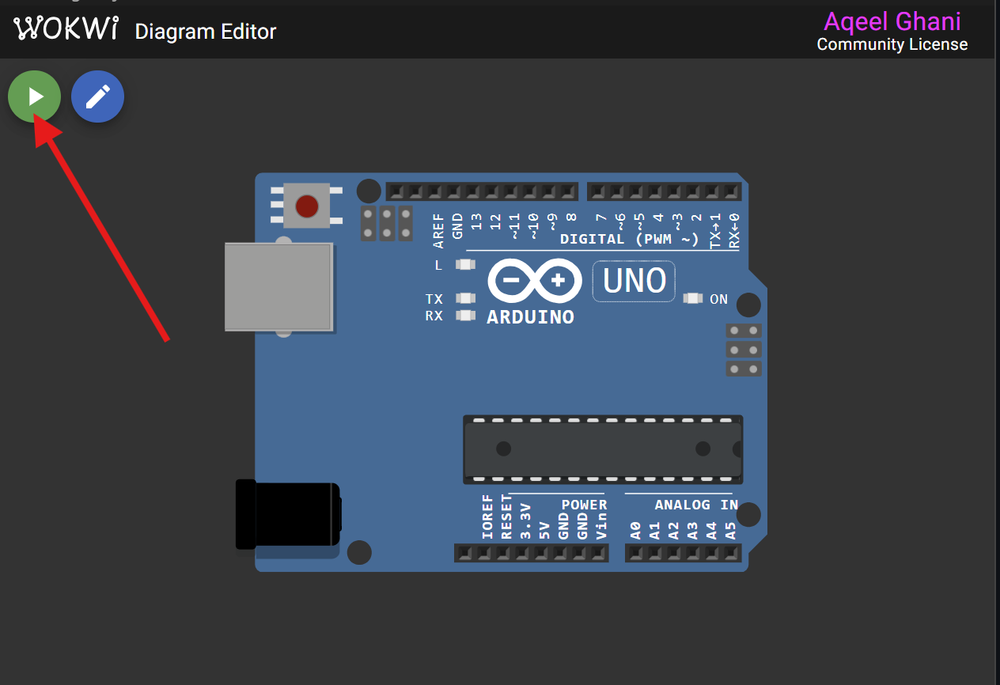

# Sistem Inventarisasi Laboratorium

Repositori ini merupakan repositori untuk Tugas Besar Pemecahan Masalah dengan Pemograman 2026 Kelompok 6 dengan anggota sebagai berikut :

1. Vanadia Valianti (13224011)
2. Kenneth Harrison Siswanto (13224032)
3. Beatrice Corryn Pangestu (13224038)
4. Muhammad Aqeel Ghani (13224071)

## Mengcompile dan Menjalankan Program

Untuk mencompile dan mengupload program dapat menggunakan extention [PlattformIO](https://docs.platformio.org/en/latest/integration/ide/vscode.html).

Untuk melakukan simulasi program dapat menggunakan [Wokwi](https://docs.wokwi.com/vscode/getting-started).

### Cara Mengcompile Menggunakan PlatformIO

Hal pertama yang harus dilakukan adalah memilih environment PlatformIO. Untuk program ini pilih environment **uno_main**.

Lalu setelah itu, tekan tombol **Build** untuk mengcompile program.

### Cara Mengupload Program ke Arduino UNO

Hal pertama yang harus dilakukan pertama dalam mengupload program ke Arduino UNO adalah memilih port yang terkoneksi dengan Arduino UNO.

Setelah itu, tekan tombol **Upload**.

### Cara Simulasi Menggunakan Wokwi

Untuk melakukan simulasi, buka file `diagram.json` dan pastikan menggunakan **Wokwi Diagram Editor**.

Lalu tekan tombol **Start the simulation**.

## Menggunakan Serial Monitor untuk Berkomunikasi dengan Arduino UNO

Untuk melakukan komunikasi dengan Arduino UNO, dapat digunakan berbagai Serial Monitor (Microsoft Serial Monitor, Arduino IDE Serial Monitor, dan lain lain). Namun, pastikan serial monitor menggunakan mode **NO LINE ENDING** saat mengirimkan pesan sehingga tidak bermasalah dengan program yang telah ditulis untuk Arduino UNO.

## Pesan Penutup

Sekian dari kami dan terimakasih atas perhatiannya. Jika ingin ditanyakan silahkan mengkontak salah satu dari kami. Terimakasih.

## Lampiran

[Video Presentasi dan Demo](https://youtube.com/playlist?list=PLRs_edC3ZZ_gmnUyWeE1VLXdyuMlJ6Fj5&si=M54ECsvDxnEOm5Ek)

[Google Docs Laporan](https://docs.google.com/document/d/1oRgPSkJoC6zzD_uECA_AX2t_n-t5MROtjOMcz_kANm0/edit?usp=sharing)